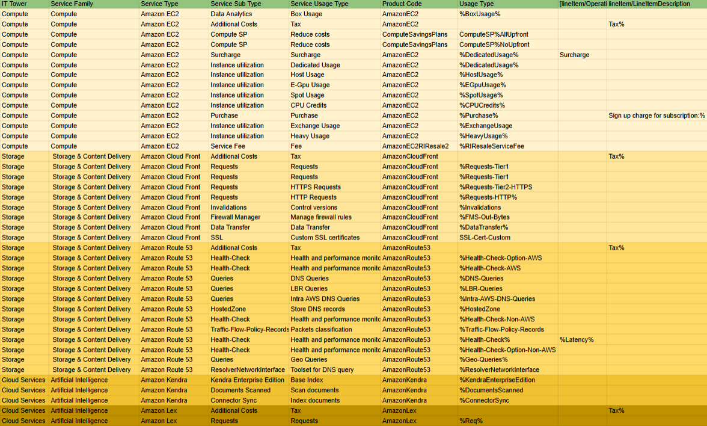

# Лабораторная работа 1. Знакомство с IaaS, PaaS, SaaS сервисами в облаке на примере Amazon Web Services (AWS). Создание сервисной модели.

## Цель работы
Знакомство с облачными сервисами. Понимание уровней абстракции над инфраструктурой в облаке. Формирование понимания типов потребления сервисов в сервисной-модели. 

## Дано
Слепок данных биллинга от провайдера после небольшой обработки в виде SQL-параметров. Символ % в начале/конце означает, что перед/после него может стоять любой набор символов.
Образец итогового соответствия, что желательно получить в конце. В этом же документе  

## Необходимо
- Импортировать файл .csv в Excel или любую другую программу работы с таблицами. Для Excel делается на вкладке Данные – Из текстового / csv файла – выбрать файл, разделитель – точка с запятой.
- Распределить потребление сервисов по иерархии, чтобы можно было провести анализ от большего к меньшему (напр. От всех вычислительных ресурсов Compute дойти до конкретного типа использования - выделенной стойка в датацентре Dedicated host usage).
- Сохранить файл и залить в соответствующую папку на Google Drive.

## Алгоритм работы
Сопоставить входящие данные от провайдера с его же документацией. Написать в соответствие колонкам справа значения 5 колонок слева, которые бы однозначно классифицировали тип сервиса. Для столбцов IT Tower и Service Family значения можно выбрать из образца.

## Ход работы

### Сервисы, которые встретились
#### Amazon EC2
Сервис облачных вычислений, предоставляющий виртуальные выделенные серверы, называемые «экземплярами», для выполнения приложений и служб. 
#### Amazon Cloud Front
Сервис доставки контента, которая безопасно и с низкой задержкой доставляет веб-страницы, видео, API и другие ресурсы пользователям по всему миру.
#### Amazon Kendra
Интеллектуальная поисковая система, использующая машинное обучение. Позволяет организациям быстро находить релевантную информацию внутри их данных.
#### Amazon Lex
Сервис для создания голосовых и текстовых чат-ботов с использованием технологий обработки естественного языка. Используется для разработки приложений с интерфейсом разговорной речи.
#### Amazon Route 53
Высокодоступный и масштабируемый облачный DNS-сервис, который управляет доменными именами и маршрутизирует запросы пользователей к приложениям в Интернете.

### Что я сделал
После ознакомления с сервисами, я выбрал для каждого соответсвующий Service Family и IT Tower из примера. Заполнил столбец Service Type, как показано в примере Mapping Rules AWS Example. Много подумав, заполнил оставишиеся 2 столбца, учитывая информацию в двух последних стобцах и Usage Type.

### Результат

## Вывод
В ходе работы я:
- Ознакомился с облачными сервисами AWS, провёл анализ биллинга, распределил потребление сервисов по иерархии, заполнил и раскрасил табличку
- Узнал, какой широкий выбор сервисов предоставляет Amazon