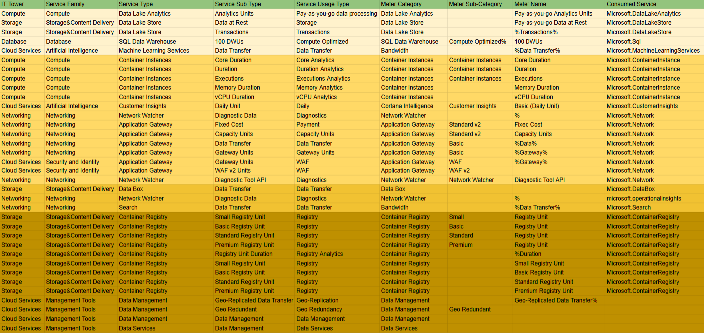

# Лабораторная работа 2. Сравнение сервисов Amazon Web Services и Microsoft Azure. Создание единой кросс-провайдерной сервисной модели. Вариант 9

## Цель работы
Получение навыков аналитики и понимания спектра публичных облачных сервисов без привязки к вендору. Формирование у студентов комплексного видения Облака. 

## Дано
- Данные лабораторной работы 1.
- Слепок данных биллинга от провайдера после небольшой обработки в виде SQL-параметров. Символ % в начале/конце означает, что перед/после него может стоять любой набор символов.
- Образец итогового соответствия, что желательно получить в конце. В этом же документе  

## Необходимо
- Импортировать файл .csv в Excel или любую другую программу работы с таблицами. Для Excel делается на вкладке Данные – Из текстового / csv файла – выбрать файл, разделитель – точка с запятой.
- Распределить потребление сервисов по иерархии, чтобы можно было провести анализ от большего к меньшему (напр. От всех вычислительных ресурсов Compute дойти до конкретного типа использования - выделенной стойка в датацентре Dedicated host usage).
- Сохранить файл и залить в соответствующую папку на Google Drive.

## Алгоритм работы
Сопоставить входящие данные от провайдера с его же документацией. Написать в соответствие колонкам справа значения 5 колонок слева, которые бы однозначно классифицировали тип сервиса. Для столбцов IT Tower и Service Family значения можно выбрать из образца. В ходе выполнения работы не отходить от принципов классификации, выбранных в Лабораторной работе 1.

## Ход работы

### Сервисы, которые встретились
#### Azure Data Lake
Сервис, используемый как масштабируемое хранилище данных. Также выполняет функции любых видов их обработки и анализа.
#### Azure SQL
Сервис облачных баз данных, для хранения и обработки реляционных данных, а также генерации отчетности. Предлагает управляемые SQL-сервисы с высокой производительностью.
#### Azure Machine Learning
Сервис для разработки, обучения и развертывания моделей машинного обучения в облаке.
#### Azure Container Instances
Сервис для быстрого развертывания приложений в контейнерах в облаке без необходимости управления виртуальными машинами и изучения новых инструментов.
#### Microsoft Cortana Intelligence (Azure AI)
Набор инструментов для анализа данных и построения интеллектуальных решений, включая машинное обучение и обработку больших данных.
#### Azure Virtual Network
Сервис для взаимодействия с сетевой инфраструктурой и ресурсами в Azure. Преимуществами являются: масштабируемость, доступность и изоляция.
#### Azure Data Box
Устройства для безопасной передачи больших объемов данных в облако Azure.
#### Azure Network Watcher
Инструмент для мониторинга, диагностики и анализа сетевой инфраструктуры в облаке Azure. Помогает выявлять и устранять сетевые проблемы, обеспечивать производительность и безопасность сети.
#### Azure Container Registry
Реестр контейнеров для хранения и управления образами - Docker и Open Container Initiative (OCI).

### Что я сделал
После ознакомления с сервисами, я выбрал для каждого соответсвующий Service Family и IT Tower из примера. Заполнил столбец Service Type, как показано в примере Mapping Rules AWS Example. Много подумав, заполнил оставишиеся 2 столбца, учитывая информацию в трёх последних стобцах.

### Результат

## Вывод
В ходе работы я:
- Ознакомился с облачными сервисами Microsoft Azure, провёл анализ биллинга, распределил потребление сервисов по иерархии, заполнил и раскрасил табличку
- Узнал, какой широкий выбор сервисов предоставляет Microsoft Azure