# Отчёт по лабораторной работе №1
Выполнил Анисимов Владислав К3240
## Техническое задание
1. Подключение должно осуществляться через протокол https с сертификатом;
2. Настроить принудительное перенаправление HTTP-запросов (порт 80) на HTTPS (порт 443) для обеспечения безопасного соединения;
3. Использовать alias для создания псевдонимов путей к файлам или каталогам на сервере;
4. Настроить виртуальные хосты для обслуживания нескольких доменных имен на одном сервере.
## Установка nginx
Для начала установим nginx:  
```shell
sudo apt install nginx
```
и запустим его:  
 ```shell 
sudo systemctl nginx start
```
[//]:(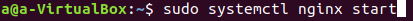)
Теперь в локальной сети работает стандартная страничка nginx:  
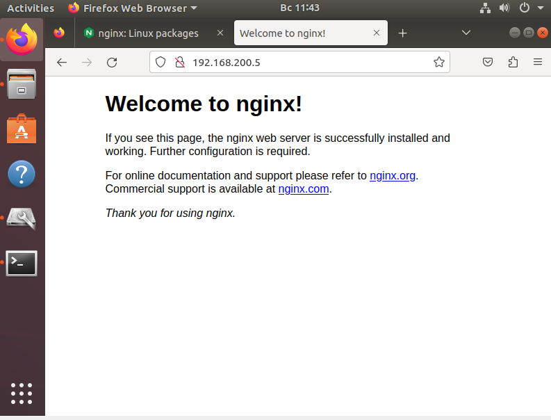  
Создадим 2 наших сайта и конфигурации к ним:  
 ```shell
sudo mkdir /var/www/testsite1.local
sudo mkdir /var/www/testsite2.local
sudo mkdir /etc/nginx/sites-available/testsite1.local.conf
sudo mkdir /etc/nginx/sites-available/testsite2.local.conf
```
[//]:(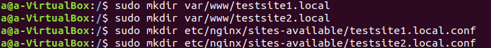)
Добавим их домены в hosts:  
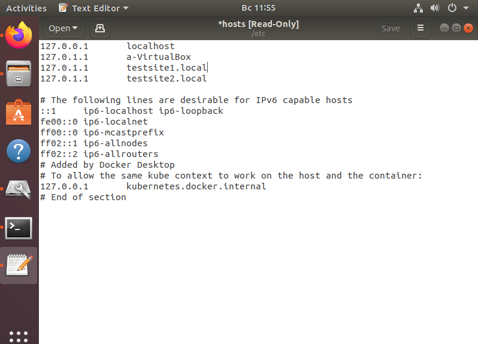  
Активируем наши сайты и перезагрузим nginx:  
 ```shell
sudo ln -s /etc/nginx/sites-available/testsite1.local.conf /etc/nginx/site-enabled/
sudo ln -s /etc/nginx/sites-available/testsite2.local.conf /etc/nginx/site-enabled/
```
[//]:(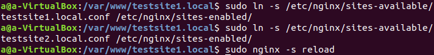)
Теперь они работают, если ввести их в поисковую строку браузера:  
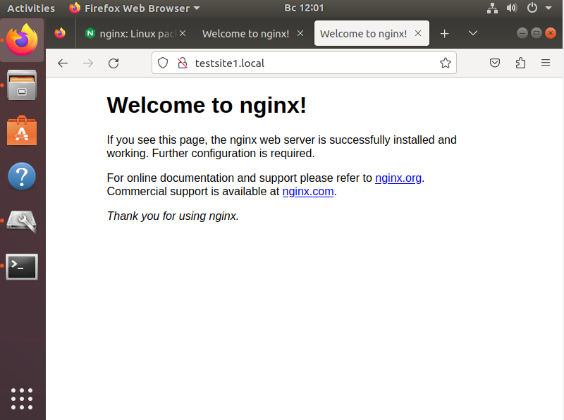  
Сгенерируем ssl ключи, чтобы сайты работали через https:  
 ```shell
sudo openssl req -x509 -newkey rsa:4096 -keyout key.pem -out cert.pem -sha256 -days 365 -nodes
```
[//]:(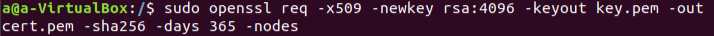)
И добавим их в конфиг  
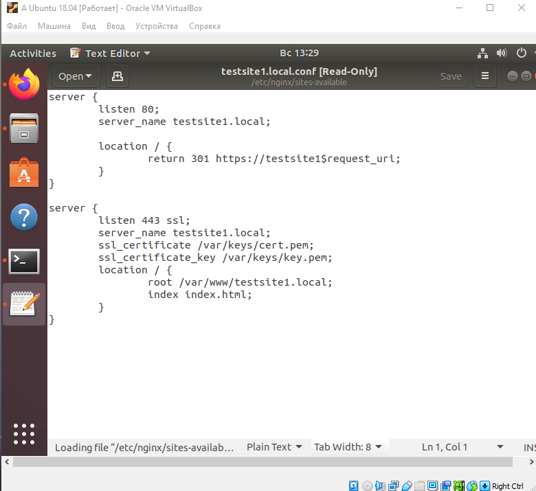  
Firerox ругается на самоподписной ключ:  
  
Но зато сайт работает через https:  
_Скачал какой-то шаблон сайта, чтобы было красивенько=)_
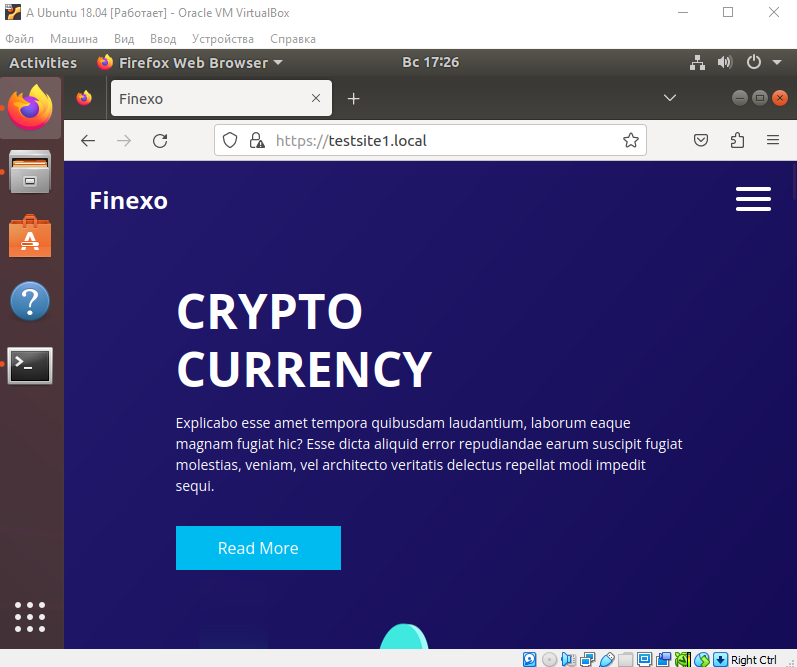  
Добавим alias, например, для картинок:  
_А также, я переименовал ключи и переместил их в /etc/nginx/ssl, чтобы они не потерялись_
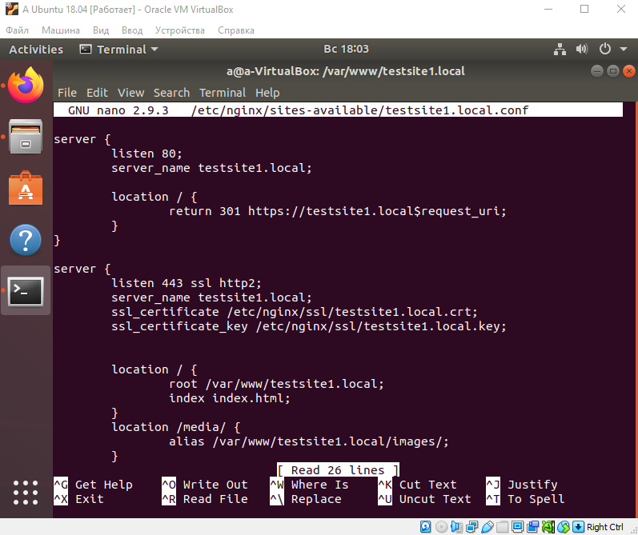  
Теперь можно смотреть картинки, используя alias:  
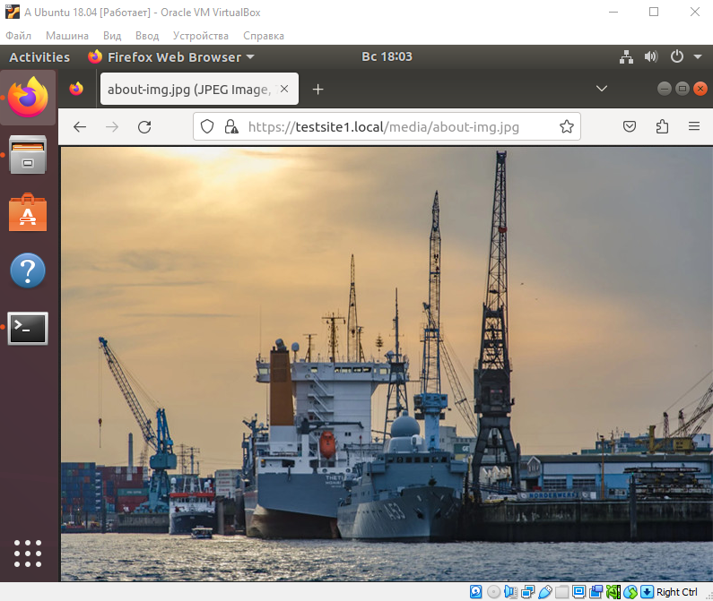  
