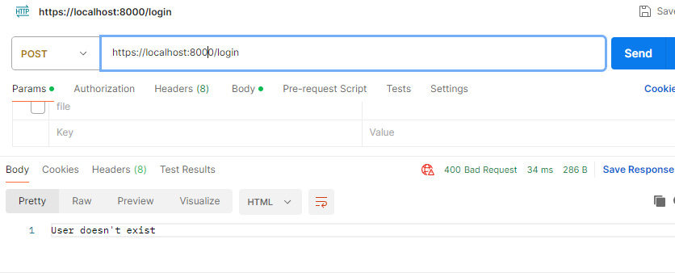
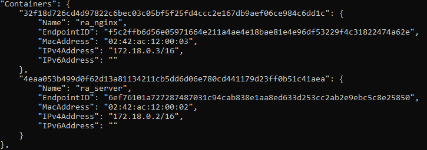
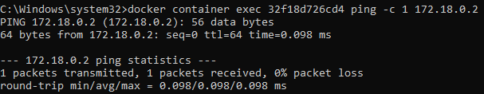
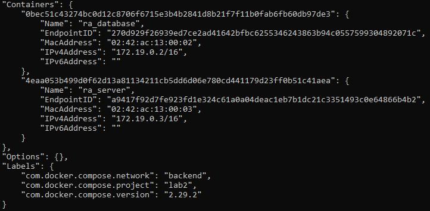
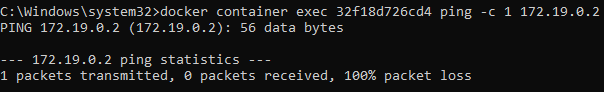

# Отчёт по лабораторной работе №2*
Выполнил Анисимов Владислав К3240
## Техническое задание
1. Написать “плохой” Docker compose файл, в котором есть не менее трех “bad practices” по их написанию
2. Написать “хороший” Docker compose файл, в котором эти плохие практики исправлены
3. В Readme описать каждую из плохих практик в плохом файле, почему она плохая и как в хорошем она была исправлена, как исправление повлияло на результат
4. После предыдущих пунктов в хорошем файле настроить сервисы так, чтобы контейнеры в рамках этого compose-проекта так же поднимались вместе, но не "видели" друг друга по сети. В отчете описать, как этого добились и кратко объяснить принцип такой изоляции
## Написание плохого Docker-compose
_Для этой лабораторной я решил упаковать свой проект из предыдущего семестра "Recipes-App" в контейнеры Docker_
#### 1. Выбрасывание портов внутренних сетей наружу
Открывать доступ к базе данных извне не лучшая идея.
```
ports:
  - "27017:27017"
```
#### 2. Отсутствие healthcheck
Некоторые контейнеры зависят от других. Без healthcheck мы не знаем, готов ли сервис к работе. Это может привести, например, что сервер начнет работу до того, как база данных будет готова. 
#### 3. Использование latest
Образ mongo:latest может измениться, из-за чего наша система может перестать работать.
## Написание хорошего Docker-compose
#### 1. Спрячем порты внутренних сетей
Уберём у контейнера с бд:
```
ports:
  - "27017:27017"
```
Теперь доступ к контейнеру осуществляеться только через внутреннюю сеть backend.
#### 2. Отсутствие healthcheck
Добавим healthcheck. Он будет проверять доступность нашего контейнера, который будет считаться работоспособным, healthcheck завершится успешно.
#### 3. Используем тэг noble
используем "noble" версию mongodb вместо latest.

_Делаем запрос к nginx и получаем ответ от сервера_
## Изоляция контейнеров
Создадим две сети: frontend и backend. Таким образом контейнеры в одной сети не будут "видеть" контейнеры в другой сети.
Вот результаты:
Попробуем из nginx сделать запрос:
1. На сервер  
  
  
2. В базу данных  
  
  
