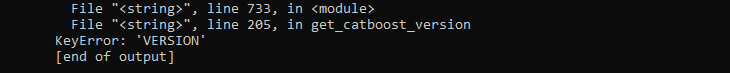
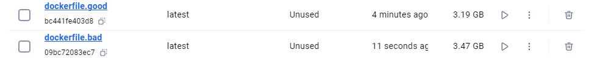
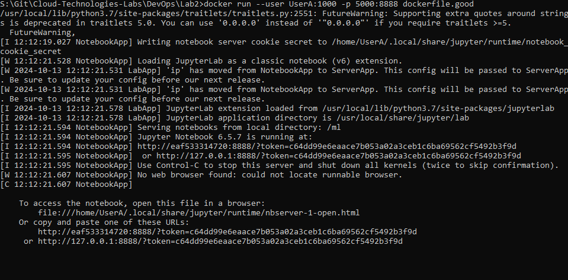
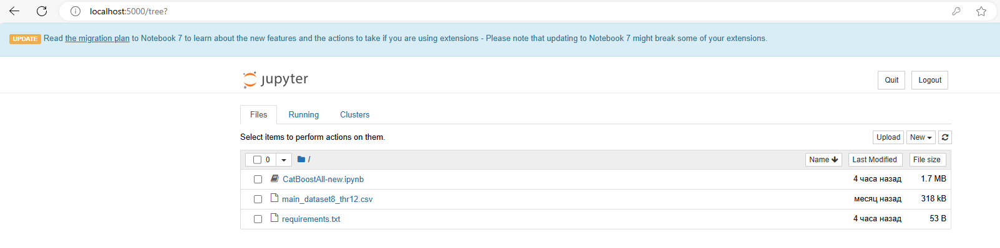

# Отчёт по лабораторной работе №2
Выполнил Анисимов Владислав К3240
## Техническое задание
1. Написать “плохой” Dockerfile, в котором есть не менее трех “bad practices” по написанию докерфайлов
2. Написать “хороший” Dockerfile, в котором эти плохие практики исправлены
3. В Readme описать каждую из плохих практик в плохом докерфайле, почему она плохая и как в хорошем она была исправлена, как исправление повлияло на результат
4. В Readme описать 2 плохих практики по работе с контейнерами. ! Не по написанию докерфайлов, а о том, как даже используя хороший докерфайл можно накосячить именно в работе с контейнерами.
## Написание плохого Dockerfile
#### 1. Использование python:latest
Использование метки latest для базового образа в Dockerfile приводит к неопределенности и отсутствию контроля над версиями.
#### 2. Копирование ненужных файлов
Копирование ненужных файлов в контейнер увеличивает размер Docker-образа, что замедляет его  загрузку и развертывание.
#### 3. Множественные инструкции RUN
Каждая инструкция RUN в Dockerfile создает новый слой файловой системы, что увеличивает размер итогового образа и замедляет процесс его создания.
#### 4. Установка избыточных пакетов
Установка ненужных или избыточных пакетов увеличивает размер образа. Избыточные пакеты также могут усложнить поддержку и обновление образа. Рекомендуется устанавливать только те пакеты, которые действительно необходимы для работы контейнера.
## Написание хорошего Dockerfile
#### 1. Указание корректной версии
Укажем версию python 3.7, которая требуется для работы CatBoost\
_latest уже не работает, и Dockerfile.bad не собирается_

#### 2. Копируем только нужное
Скопируем только нужные файлы, с которыми мы будем работать
#### 3. Используем requirements и &&
Чтобы уменьшить количество слоёв в Docker контейнере соединим некоторые инструкции RUN и используем requirements.txt для для устанвки зависимостей
#### 4. Уберём лишние пакеты
Пакеты pandas, numpy и так будут установлены вместе с catboost, поэтому нет смысла их отдельно прописывать. Кроме того, можно установить ещё и некорректную версию этих пакетов.


## Плохие практики при работе с контейнерами
#### 1. Отсутствие ограничения ресурсов  
Запуск контейнеров без ограничения на использование ресурсов может привести к тому, что одно приложение заберет все ресурсы хоста.

Лучше использовать ```--memory и --cpus```
#### 2. Запуск контейнеров с правами root  
Запускать контейнеры от имени пользователя root небезопасно, так как это открывает доступ к основной системе. 

Лучше создать не-root пользователя внутри контейнера и использовать ```--user <user>:<group>```.
#### 3. Хранение секретов в образах контейнеров
Не следует хранить пароли, ключи API или другие секреты в Dockerfile или добавлять их непосредственно в образы контейнеров. 

Вместо этого лучше передавать их через ```--secret id=<secret-id>,src=<src>```.
## Итог


