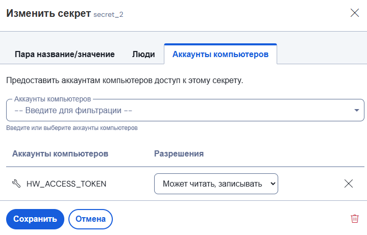

# Отчёт по лабораторной работе №3*
Выполнил Анисимов Владислав К3240
## Техническое задание
Сделать красиво работу с секретами. Например, поднять Hashicorp Vault (или другую секретохранилку) и сделать так, чтобы ci/cd пайплайн (или любой другой ваш сервис) ходил туда, брал секрет, использовал его не светя в логах. В Readme аргументировать почему ваш способ красивый, а также описать, почему хранение секретов в CI/CD переменных репозитория не является хорошей практикой.
## Ход работы
- Сначала я попробовал использовать Hashicorp Vault, но как-то не пошло - что-то сложно.
- Я решил использовать Bitwarden. К тому же, там есть туториал как им пользоваться.   
- После регистрации я создал компьютер и секрет для теста.   
   
- Сохранил токен компьютера в secrets у GitHub.
- Ничего не работало, так как я забыл дать доступ компьютеру к токену   
_Не спрашивайте, почему у компьютера такое же имя как у токена =)_   

## Результат
   
Секреты  успешно получены с Bitwarden и при попытке их "спалить" выводится _нечто_
