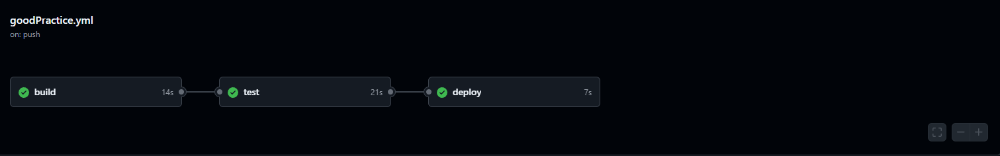

# Отчёт по лабораторной работе №3
Выполнил Анисимов Владислав К3240
## Техническое задание
1. Написать “плохой” CI/CD файл, который работает, но в нем есть не менее пяти “bad practices” по написанию CI/CD
2. Написать “хороший” CI/CD, в котором эти плохие практики исправлены
3. В Readme описать каждую из плохих практик в плохом файле, почему она плохая и как в хорошем она была исправлена, как исправление повлияло на результат
4. Прочитать историю про Васю (она быстрая, забавная и того стоит): https://habr.com/ru/articles/689234/ ✔️
## Написание плохого CI/CD
### 1. Использование ubuntu-latest
Использование метки latest приводит к неопределенности и отсутствию контроля над версиями.
### 2. Нет версии .NET
Тоже приводит к неопределенности и отсутствию контроля над версиями.
### 3. Нет кэширования
Каждый раз нужно долго подождать=(
### 4. Нет разделения на job-ы
Не удобно когда всё выводится списком, сложно читать
### 5. Не используются переменные для повторений
Нужно поменять путь во всех местах и потратить на это время, а не хочется
### Результат

## Написание хорошего CI/CD
### 1. Использование конкретной версии ubuntu
Используем конкретную версию, например   
```yaml
ubuntu-22.04
```
### 2. Укажем версию .NET
Используем конкретную версию, например   
```yaml
- name: Set up .NET
    uses: actions/setup-dotnet@v3
    with:
      dotnet-version: 8.0.x
```
### 3. Добавим кэширование
```yaml
- name: Set up .NET
    uses: actions/setup-dotnet@v3
    with:
      dotnet-version: 8.0.x
      cache: true
```
### 4. Разделим на job-ы
```yaml
jobs:
  build: 
    ...

  tests: 
    ...

  deploy: 
    ...
```
### 5. Используем переменные для повторений
```yaml
env:
  App_Path: ./DevOps/Lab3/TestApp
```
```yaml
- name: Upload build artifacts
        uses: actions/upload-artifact@v3
        with:
          name: build-output
          path: ${{ env.App_Path }}/**/bin/Release/net8.0/
```
### Результат

### Artifact

## Вывод
После выполнения этой лабы я познакомился с CI/CD и github actions, поработал c .NET, понял как оно там происходит и сделал отчёт